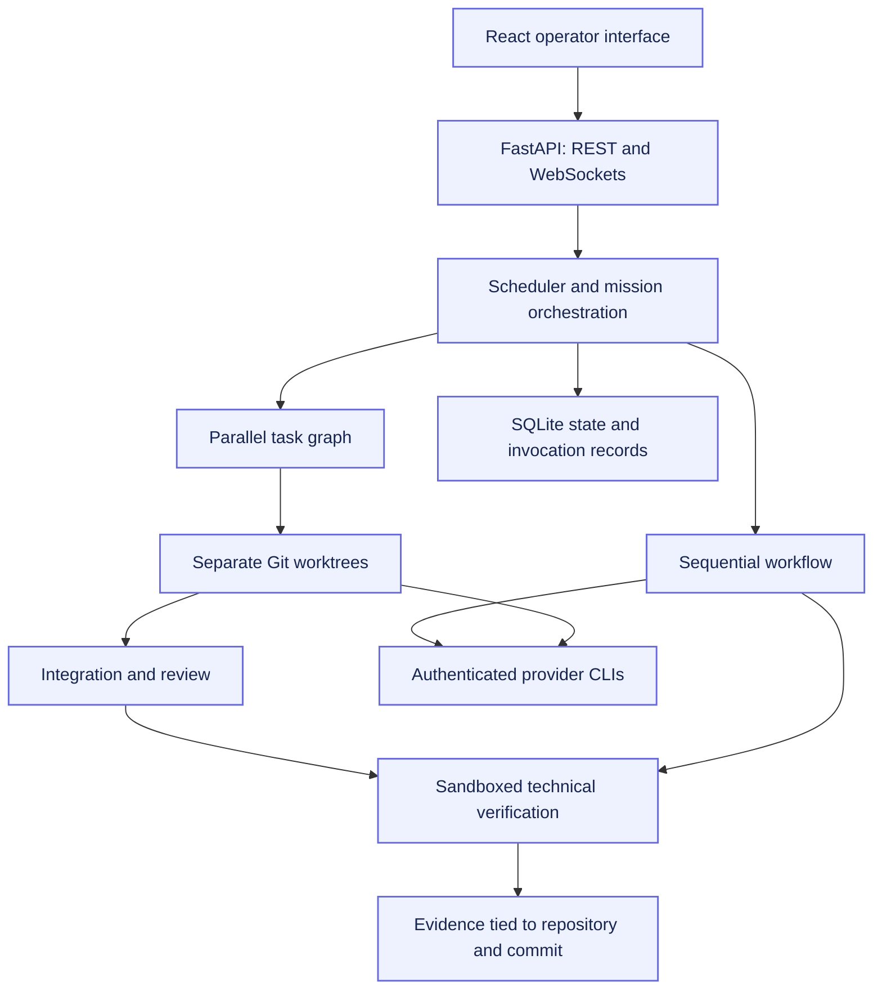
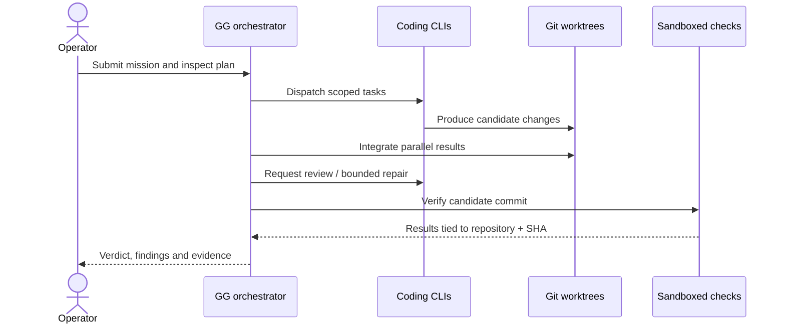

<div align="center">

# GG Orchestrator

**A local control plane for coding agents, from task planning to artifact verification.**

React · TypeScript · FastAPI · SQLite · Git worktrees

[Get started](#get-started) · [Architecture](ARCHITECTURE.md) · [Providers](PROVIDERS.md) · [Security](SECURITY.md) · [Rights reserved](LICENSE)

</div>

## Overview

GG coordinates authenticated coding CLIs through a browser interface. It turns a
repository task or product plan into an observable execution workflow: planning,
implementation, testing, review, integration and technical verification.

Built end to end by [Ayham Joumran](https://github.com/AyhamJo7), including the
React/TypeScript interface, FastAPI backend, SQLite persistence, provider adapters
and regression tests.

**Current scope:** local, single-operator software. GG is not a hosted multi-user
service. It uses installed provider CLIs and their existing authentication;
availability depends on your accounts, installed versions and provider capacity.

## Capabilities

| Capability | How it works |
| --- | --- |
| Multiple coding providers | Adapters for Claude Code, Codex, Antigravity and OpenCode |
| Parallel development | Dependency-aware tasks in separate Git worktrees, followed by integration |
| Product planning | Structured requirements, architecture and sequential roadmap phases |
| Review and repair | Review findings, bounded repair attempts and explicit stop reasons |
| Objective verification | Toolchain and acceptance commands confined with Linux bubblewrap |
| Artifact provenance | Repository- and commit-scoped review, verification and delivery evidence |
| Recovery | Persisted execution state, process ownership and restart reconciliation |
| Operator visibility | Mission progress, provider invocations, context manifests and usage provenance |

The distinction between an agent finishing and an artifact passing acceptance is
central to GG. A mission can finish while its product remains blocked or unverified.

## Architecture



[Current architecture](ARCHITECTURE.md) describes implemented behavior and known
limits. The separate [architecture audit](docs/ARCHITECTURE.md) includes proposals;
its recommendations are not a feature list.

## Get started

Requirements: Python 3.12+, `uv`, Node/npm, Git and at least one authenticated
provider CLI on `PATH`. Objective verification also requires Linux `bubblewrap`
(`bwrap`) with working unprivileged user namespaces. Verification fails closed
when its sandbox is unavailable.

From a local source checkout:

```bash
make install
make dev
```

Open **http://localhost:5173**. The backend binds to **127.0.0.1:8787**.
Provider selection and priorities are configured in
[`config/orchestrator.yaml`](config/orchestrator.yaml).

`make dev` initializes the local bearer token before starting Vite. State and token
live in `backend/.orchestrator/` under this workflow. Run one backend per state
directory.

> **Local interface only:** Vite embeds this checkout's bearer token at dev/build
> time. Do not publish the built frontend, expose the service through a public
> tunnel, or upload runtime state and logs.

## Two workflows

### Work on an existing repository

Register a repository, create a mission, and choose sequential execution or
**Parallel Safe**. Parallel tasks use separate worktrees and an integration step.
Inspect the plan, execution results, review findings and technical checks.

### Develop a product from an idea

Create an idea, generate its plan, inspect requirements and architecture, then
select **Start Project**. Roadmap phases become sequential missions. External
prerequisites become Human Gates; product acceptance checks executable criteria
and repeats the detected toolchain in a fresh checkout before recording delivery.

Use the explicit Start action. Current auto-execute/approval fields do not provide
a reliable unattended approval workflow.

## From task to evidence



## What the verdicts mean

| Verdict | Meaning |
| --- | --- |
| `COMPLETED` | Mission execution verdict; separate from product delivery |
| `DELIVERED` | Product acceptance verdict backed by current repository/commit evidence |
| `UNVERIFIED` | Required verification is unavailable or has not established acceptance |
| `BLOCKED` | Acceptance or prerequisites prevent progression |

Code-changing autonomous repairs require an independent reviewer outside the
candidate's writer set and an exact-commit recheck. Other review paths can degrade
to disclosed self-review; inspect reviewer provenance. Repair budgets bound
attempts, and environment or ambiguous failures stop for operator intervention.

## Design decisions

- **Git worktrees isolate parallel changes.** Integration remains an explicit
  stage; parallel execution does not guarantee conflict-free results.
- **SQLite keeps deployment local.** Durable state supports recovery without a
  separate database service; multiple backend owners are unsupported.
- **Checks are tied to artifacts.** Historical passing checks cannot certify a
  changed commit or another repository.
- **Usage has provenance.** Provider-reported, CLI-reported and unknown usage stay
  distinct. GG does not infer subscription quota or billing from token estimates.

## Development and safety

```bash
make test-backend
make test-frontend
make lint
make typecheck
make e2e
```

Routine tests use fake providers and temporary fixtures. `make smoke` and real
missions invoke providers and consume account capacity.

Provider CLIs have substantial local authority and are not uniformly sandboxed.
The objective-check sandbox does not contain every provider action. Raw local logs
can contain confidential request content; output redaction is heuristic. Read
[SECURITY.md](SECURITY.md) before selecting repositories or exposing any interface.

## Documentation

| Document | Purpose |
| --- | --- |
| [Architecture](ARCHITECTURE.md) | Components, execution semantics, evidence and limits |
| [Development](DEVELOPMENT.md) | Setup, checks, migrations and desktop shell |
| [Providers](PROVIDERS.md) | Adapter contracts and output/usage visibility |
| [Troubleshooting](TROUBLESHOOTING.md) | Recovery and operator diagnostics |
| [Publication preparation](PUBLICATION.md) | History review, packaging boundaries and outstanding release decisions |

## License and public inspection

**Proprietary · All rights reserved.** This repository is available for portfolio
inspection. It is not open source; running, modifying, deploying or redistributing
it requires prior written permission. GitHub platform rights and third-party
license terms remain applicable. See [LICENSE](LICENSE).

The setup instructions document the author's workflow and do not grant a usage
license. See [PUBLICATION.md](PUBLICATION.md) for the publication review record.
